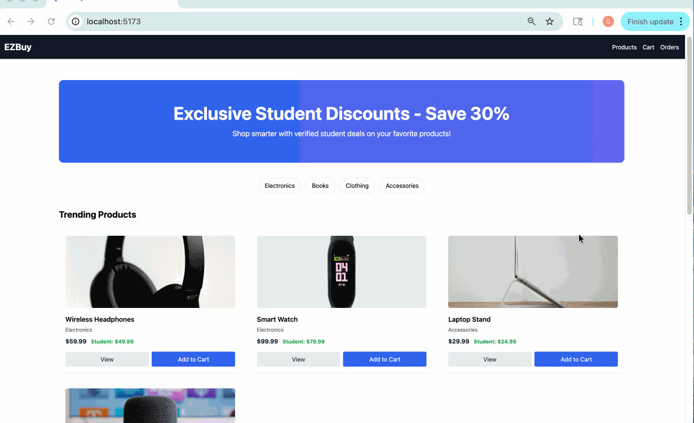
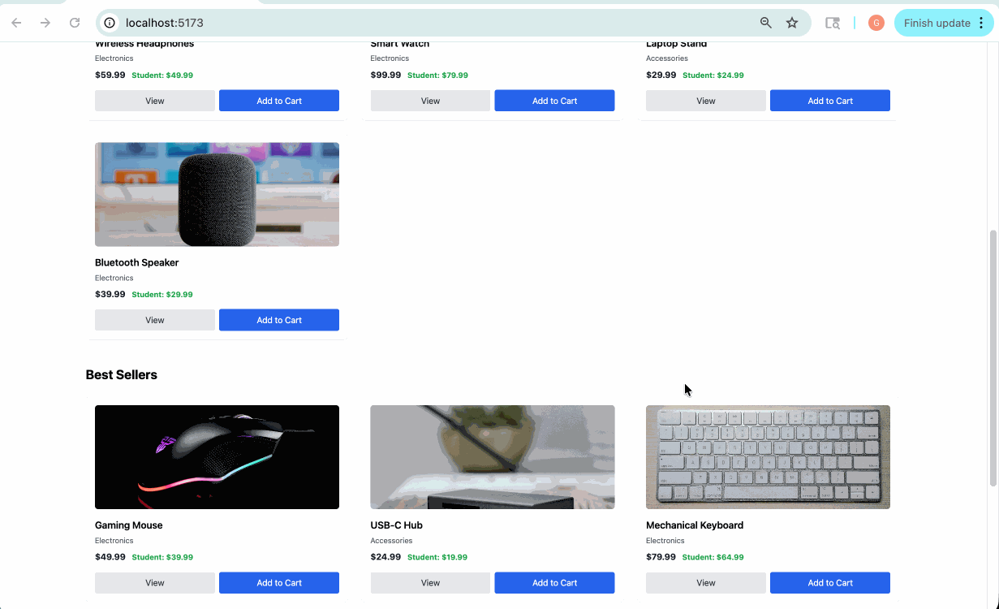
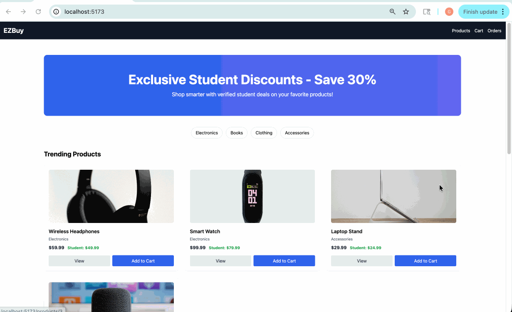

# EZBuy

CodePath WEB103 Final Project

**Designed and developed by:** Abdessamad Ballaj, Abdul Wakil Najibi, Gulzira Abdullah

# EZBuy

🔗 Link to deployed app: (will be added after deployment)

## About

### 📖 Description and Purpose

EZBuy is a modern, full-stack ecommerce platform designed for everyday shopping needs. The application provides a clean and intuitive interface for users to browse products, manage their shopping cart, and complete secure purchases. Built with a focus on simplicity and user experience, EZBuy streamlines the online shopping process while offering features like student discounts, order tracking, and personalized recommendations.

### 💡 Inspiration

Online shopping has become essential in our daily lives, yet many ecommerce platforms are cluttered with unnecessary features, slow performance, or complicated checkout processes. As students and frequent online shoppers, we noticed the frustration of navigating overly complex websites just to purchase everyday items. We wanted to create a streamlined shopping experience that prioritizes speed, clarity, and user satisfaction. EZBuy was born from our desire to build an ecommerce platform that focuses on what matters most: helping users find what they need quickly and complete their purchases effortlessly. With the addition of student discounts, we're also addressing the financial challenges faced by our peers in the student community.

## 🛠️ Tech Stack

**Frontend:** React (Vite), React Router, Tailwind CSS

**Backend:** Node.js, Express, PostgreSQL

**Authentication:** Firebase Auth / GitHub OAuth

**Payments:** Stripe API

**Deployment:** Render

## ✨ Features

### ✅ 🛍️ Product Catalog & Browse

Browse a comprehensive catalog of everyday products with clear images, descriptions, and pricing. Products are organized into intuitive categories for easy navigation and discovery.

### ✅ 🔍 Product Detail Views

View detailed product information including high-quality images, full descriptions, specifications, pricing, and availability. Make informed purchasing decisions with all the information you need in one place.

### ✅ 🛒 Shopping Cart Management

Add, remove, and update product quantities in your shopping cart. View real-time cart totals and proceed to checkout seamlessly with a persistent cart that saves your selections.

### 💳 Secure Checkout with Stripe

Complete purchases securely using Stripe payment integration. Process payments safely with industry-standard security and receive instant order confirmation.

### 🔐 User Authentication

Register and sign in using Firebase Authentication or GitHub OAuth. Maintain a personalized shopping experience with secure account management and session handling.

### 📦 Order History & Tracking

View your complete purchase history with details about past orders, including items purchased, order dates, and total amounts. Track your orders and revisit previous purchases easily.

### 🎓 Student Discount Program

Students can register using their .edu email address to access exclusive discounts on eligible products. Verified student accounts automatically display discounted pricing throughout the shopping experience.

### ✅ 🔔 Toast Notifications

Receive instant feedback for user actions with sleek toast notifications. Stay informed when items are added to cart, orders are placed, or errors occur, enhancing the overall user experience.

### 🔎 Search & Filter Products *(Stretch)*

Quickly find specific products using the search functionality and filter results by category, price range, or other criteria to narrow down your options efficiently.

### 📊 Product Sorting *(Stretch)*

Sort products by price (low to high, high to low), popularity, newest arrivals, or other relevant criteria to browse more effectively and find exactly what you're looking for.

### 👨‍💼 Admin Dashboard *(Stretch)*

Administrators can manage the product inventory through a dedicated dashboard, including adding new products, editing existing items, updating stock levels, and removing discontinued products.

### ❤️ Wishlist / Save for Later *(Stretch)*

Save products you're interested in to a wishlist for future reference. Easily access and manage saved items and move them to your cart when ready to purchase.

## 📥 Installation Instructions

(will be added during development)