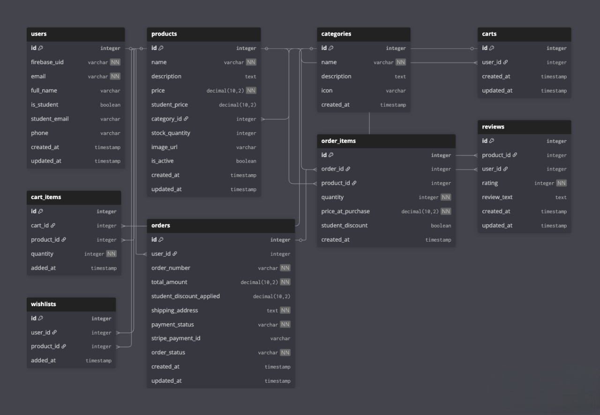

# Entity Relationship Diagram

## List of Tables

- users
- products
- categories
- carts
- cart_items
- orders
- order_items
- reviews
- wishlists

## Entity Relationship Diagram

## Tables Description

### users
| Column Name | Type | Description |
|-------------|------|-------------|
| id | integer | primary key |
| firebase_uid | varchar | unique Firebase authentication ID |
| email | varchar | user email address |
| full_name | varchar | user's full name |
| is_student | boolean | whether user has verified student status |
| student_email | varchar | verified .edu email for student discounts |
| phone | varchar | user phone number |
| created_at | timestamp | account creation timestamp |
| updated_at | timestamp | last update timestamp |

### products
| Column Name | Type | Description |
|-------------|------|-------------|
| id | integer | primary key |
| name | varchar | product name |
| description | text | detailed product description |
| price | decimal(10,2) | regular product price |
| student_price | decimal(10,2) | discounted price for students |
| category_id | integer | foreign key to categories table |
| stock_quantity | integer | available inventory count |
| image_url | varchar | product image URL |
| is_active | boolean | whether product is currently available |
| created_at | timestamp | product creation timestamp |
| updated_at | timestamp | last update timestamp |

### categories
| Column Name | Type | Description |
|-------------|------|-------------|
| id | integer | primary key |
| name | varchar | category name (Electronics, Backpacks, etc.) |
| description | text | category description |
| icon | varchar | category icon reference |
| created_at | timestamp | category creation timestamp |

### carts
| Column Name | Type | Description |
|-------------|------|-------------|
| id | integer | primary key |
| user_id | integer | foreign key to users table |
| created_at | timestamp | cart creation timestamp |
| updated_at | timestamp | last update timestamp |

### cart_items
| Column Name | Type | Description |
|-------------|------|-------------|
| id | integer | primary key |
| cart_id | integer | foreign key to carts table |
| product_id | integer | foreign key to products table |
| quantity | integer | number of items |
| added_at | timestamp | when item was added to cart |

### orders
| Column Name | Type | Description |
|-------------|------|-------------|
| id | integer | primary key |
| user_id | integer | foreign key to users table |
| order_number | varchar | unique order identifier |
| total_amount | decimal(10,2) | total order cost |
| student_discount_applied | decimal(10,2) | discount amount applied |
| shipping_address | text | delivery address |
| payment_status | varchar | pending, completed, or failed |
| stripe_payment_id | varchar | Stripe transaction ID |
| order_status | varchar | processing, shipped, delivered, cancelled |
| created_at | timestamp | order creation timestamp |
| updated_at | timestamp | last update timestamp |

### order_items
| Column Name | Type | Description |
|-------------|------|-------------|
| id | integer | primary key |
| order_id | integer | foreign key to orders table |
| product_id | integer | foreign key to products table |
| quantity | integer | number of items ordered |
| price_at_purchase | decimal(10,2) | product price when order was placed |
| student_discount | boolean | whether student discount was applied |
| created_at | timestamp | order item creation timestamp |

### reviews
| Column Name | Type | Description |
|-------------|------|-------------|
| id | integer | primary key |
| product_id | integer | foreign key to products table |
| user_id | integer | foreign key to users table |
| rating | integer | star rating (1-5) |
| review_text | text | review content |
| created_at | timestamp | review creation timestamp |
| updated_at | timestamp | last update timestamp |

### wishlists
| Column Name | Type | Description |
|-------------|------|-------------|
| id | integer | primary key |
| user_id | integer | foreign key to users table |
| product_id | integer | foreign key to products table |
| added_at | timestamp | when product was added to wishlist |

## Relationships

- **One-to-Many**: users → orders, users → reviews, products → categories, products → reviews, products → order_items, carts → cart_items, orders → order_items
- **Many-to-Many with Join Tables**: users ↔ products (through cart_items, order_items, reviews, wishlists)
- **One-to-One**: users → carts