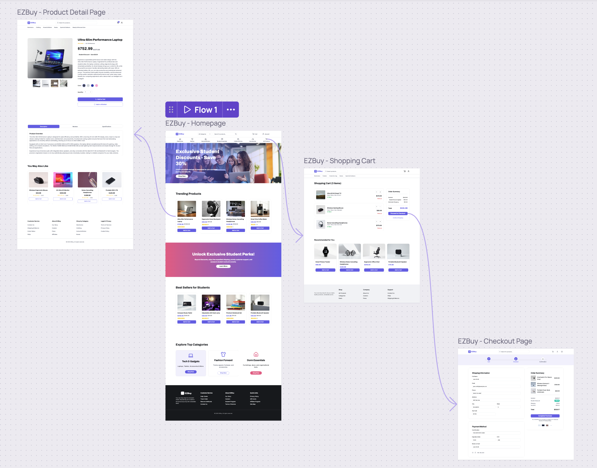
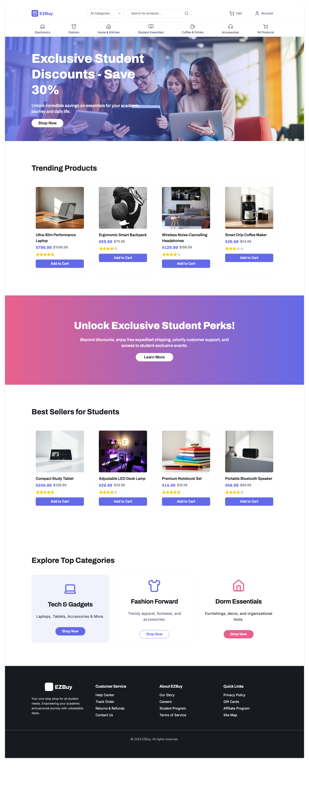
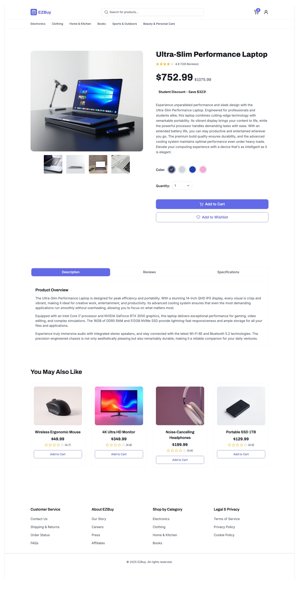
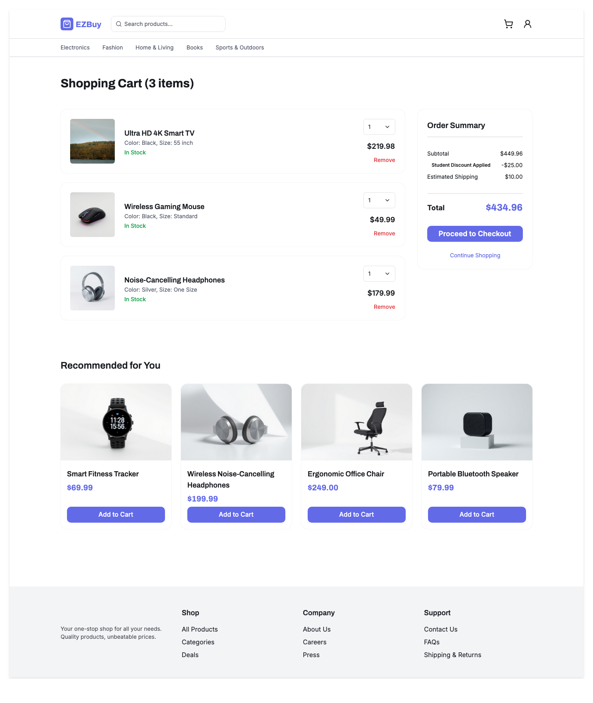
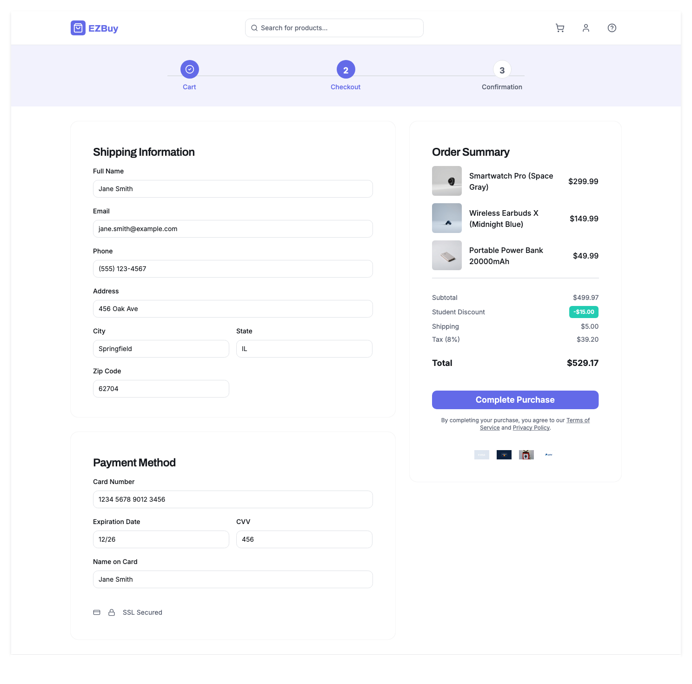

# Wireframes

## List of Pages

⭐ Home Page (Product Listings)
⭐ Product Detail Page
⭐ Shopping Cart
⭐ Checkout Page
- Login/Signup Page
- User Profile Page
- Order History Page
- Admin Dashboard (stretch)

## User Flow Diagram

This diagram shows the complete user journey through the EZBuy application, from browsing products on the home page, viewing product details, adding items to the shopping cart, and completing the checkout process.

## Wireframe 1: Home Page

## Wireframe 2: Product Detail Page

## Wireframe 3: Shopping Cart

## Wireframe 4: Checkout Page

